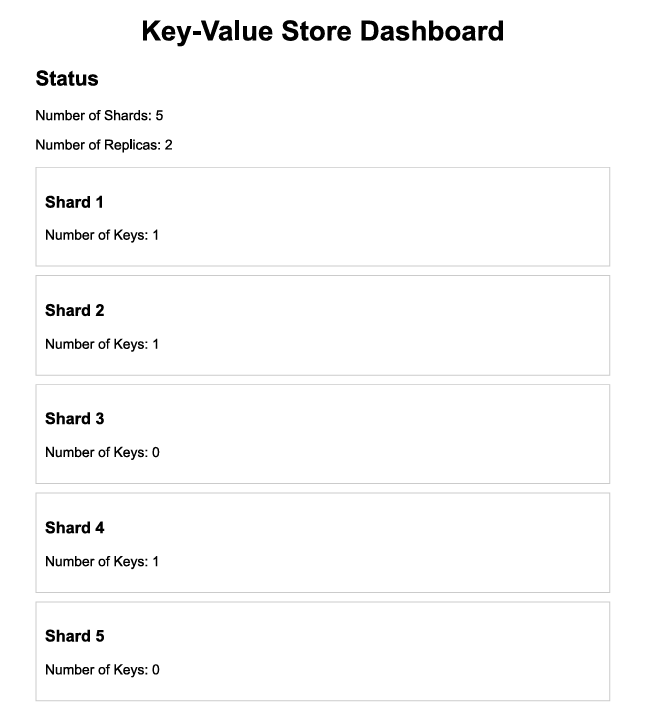

# Distributed Key-Value Store

This project implements a distributed key-value store using Go.

## Problem It Solves

- **Data Distribution and Scalability:** Sharding partitions data across multiple shards to distribute the load and enhance scalability, avoiding bottlenecks and improving performance.
- **Efficient Data Management:** By managing data across multiple shards, the system reduces contention and improves access speeds. Replication ensures data availability and durability.
- **Concurrency and Consistency:** Read-write mutexes manage concurrent access to ensure data integrity and consistency, allowing safe simultaneous read and write operations.
- **Fault Tolerance and Availability:** Replication maintains data availability and system resilience, ensuring continued operation even in the event of hardware failures.

## Workflow Overview

- Initialization
- Handling HTTP Requests
- Setting Data
- Retrieving Data
- Sharding and Replication
- Hashing and Shard Management
- Concurrency Control

### 1.Initialization

- The main function initializes the key-value store and sets up HTTP handlers.

### 2.Handling HTTP Requests

- The HTTP server listens for incoming requests and routes them to the appropriate handler functions.
- Extract Query Parameters: Extracts key, value, and ttl (Time-to-Live) from the request URL.
- Parse TTL: Converts TTL from a string to a time.Duration object.
- Call kv.Set: Stores the key-value pair with the specified TTL.

### 3. Sharding and Replication

Sharding divides the key-value store into smaller units (shards). Replication creates copies of each shard for fault tolerance.

### 4. Hashing and Shard Management

- Hashing is the process of converting an input (or "key") into a fixed-size integer, which helps determine where the data associated with that key should be stored or retrieved from. Hashing ensures that the data is distributed uniformly across different shards.
- Shard Management involves determining which shard should store or serve a particular key-value pair based on the hash value computed from the key.

### 5. Concurrency Control

- concurrency control is achieved using mutexes (mutual exclusions), specifically read-write mutexes (sync.RWMutex). These mutexes are used to manage concurrent access to data within each shard.
- A read-write mutex allows multiple readers to access the data simultaneously but ensures that only one writer can modify the data at a time. This approach optimizes performance by permitting concurrent reads while preventing write conflicts.

## Installation

#### Follow this commands to test this project

#### 1.Clone the repository:

```
https://github.com/theshubh007/Distributed_keyvalue_store
```

#### 2.Run the server:

```
  go run main.go
```

or

```
 go build .
./distributed_keyvalue_store
```

## Testing/Usage:

- Use curl or GET request through WEB browser/API testers

#### 1.Set a Key-Value Pair

```
curl "http://localhost:8080/set?key=foo&value=bar&ttl=60s"
```

#### 2. Get the Key-Value Pair

```
curl "http://localhost:8080/get?key=foo"
```

#### 3.Test Expiration

```
curl "http://localhost:8080/set?key=foo&value=bar&ttl=2s"
sleep 3
curl "http://localhost:8080/get?key=foo"

```

#### 4. Monitor the Key-Value Store:

Open your web browser and navigate to http://localhost:8080 to view the index.html dashboard.

#### 5. Dashboard API:

Access the dashboard status through the /dashboard endpoint to get the current status of the key-value store:

```
curl "http://localhost:8080/dashboard"
```



## Contributing

Contributions are welcome! Please submit a pull request or open an issue to discuss improvements or features.
